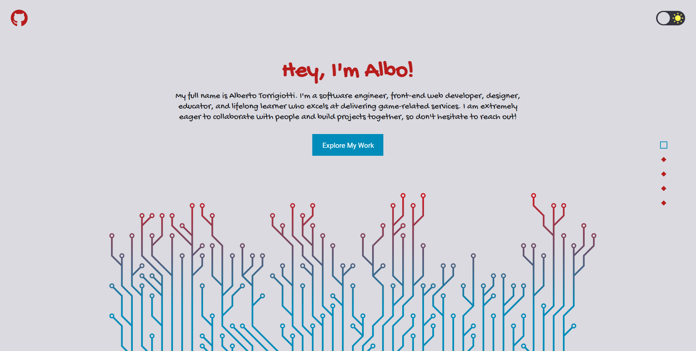

# Alberto Torrigiotti's Portfolio

## Preview

https://github.com/atorcode/portfolio/assets/95320421/541f84c8-03c8-49a0-8c62-ecf610a7953e

## Live Demo

https://atorcode.com

## Hire Me

I'm actively seeking a front-end web development position. I have a deep understanding of React, TypeScript/Javascript, SASS/CSS and computer science fundamentals. Moreover, I am confident that no matter who you are, I can improve your UX. Let's connect!

LinkedIn: https://www.linkedin.com/in/alberto-torrigiotti/  
Email: [atorcode@gmail.com](mailto:atorcode@gmail.com)  
Resume: [View my Resume](https://drive.google.com/file/d/1eiZg_wG9HioqGPmmp1US3znSWIUtWV7w/view?usp=sharing)

## Technologies Used

- React
- TypeScript
- SASS

This project was bootstrapped with Create-React-App

## License

Licensed under the [MIT License](LICENSE)
